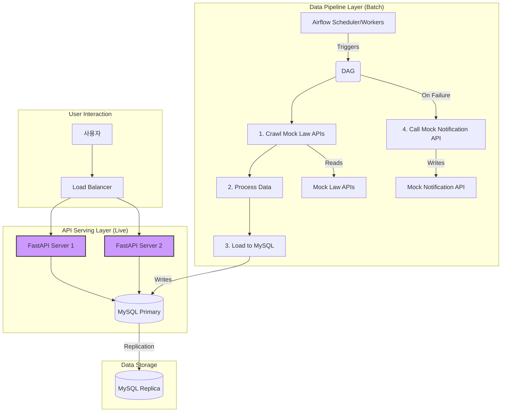
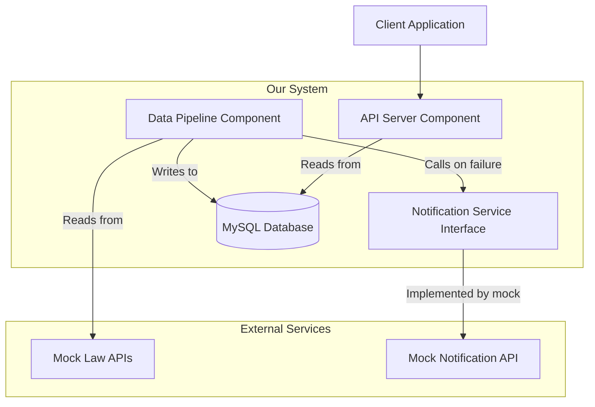
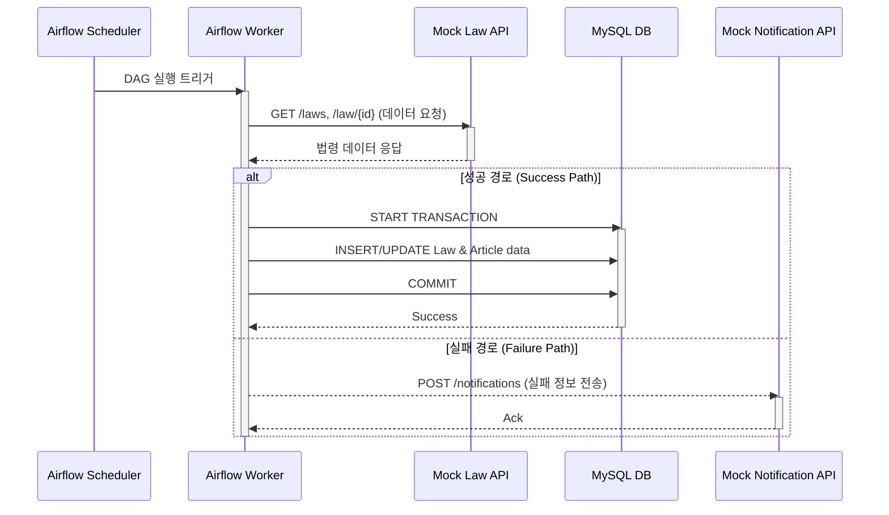
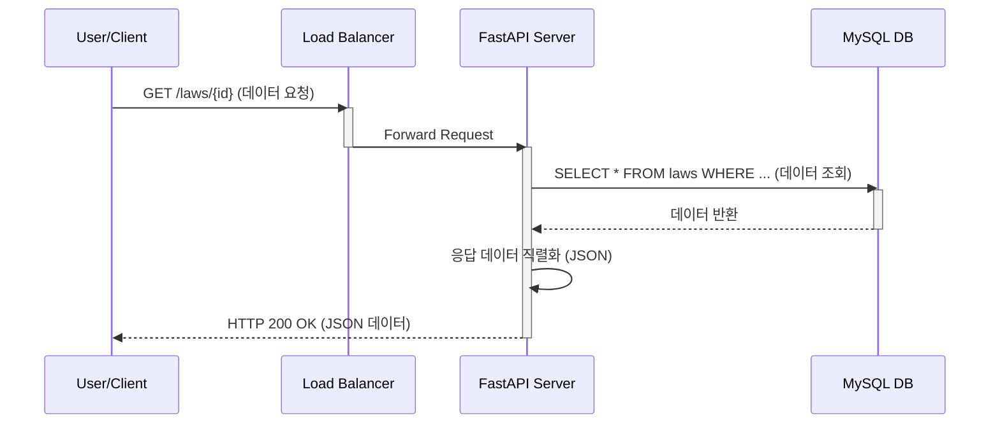

# 아키텍처 문서: 법령 정보 관리 데이터 파이프라인 및 API 서버

## 1. Introduction

이 문서는 "법령 정보 관리 데이터 파이프라인 및 API 서버" 프로젝트의 전반적인 아키텍처를 설명합니다. 여기에는 백엔드 시스템, 데이터 파이프라인, API 서버 및 UI와 관련 없는 공유 서비스가 포함됩니다. 이 문서의 주요 목표는 AI 기반 개발을 위한 아키텍처 청사진 역할을 하여, 선택된 패턴과 기술의 일관성을 보장하는 것입니다.

### 1.1. Starter Template or Existing Project

프로젝트 개요서를 검토한 결과, 이 프로젝트는 특정 스타터 템플릿이나 기존 코드베이스를 기반으로 하지 않는 '그린필드(Greenfield)' 프로젝트입니다.

**결정:**
Python, Airflow, FastAPI, MySQL 등 명확히 정의된 기술 스택을 사용하므로, 표준 템플릿에 의존하기보다 과제 요구사항에 최적화된 맞춤형 구조로 프로젝트를 설정하는 것이 효율적입니다. 따라서 별도의 스타터 템플릿 없이 직접 구조를 설계하며 진행하겠습니다.

### 1.2. Change Log

| Date | Version | Description | Author |
| :--- | :--- | :--- | :--- |
| 2025-10-25 | 0.1 | Initial architecture draft creation. | Winston (Architect) |

---

## 2. High Level Architecture

이 섹션에서는 프로젝트 아키텍처의 기반을 설정하는 여러 하위 섹션을 한 번에 제시합니다.

### 2.1. Technical Summary

본 시스템은 데이터 수집을 담당하는 **배치 파이프라인**과 데이터 제공을 담당하는 **API 서버**가 분리된(Decoupled) 아키텍처 스타일을 채택합니다. 주요 구성 요소는 다음과 같습니다:

*   **데이터 파이프라인**: Apache Airflow를 오케스트레이션 도구로 사용하여 주기적인 데이터 수집, 처리, 저장을 관리합니다.
*   **데이터 저장소**: MySQL 데이터베이스를 사용하여 법령 데이터를 저장하며, Primary-Replica 구조로 가용성을 확보합니다.
*   **API 서버**: FastAPI를 사용하여 구축된 API 서버는 로드 밸런서 뒤에서 다중 인스턴스로 운영되어 무중단 서비스를 제공합니다.

이 아키텍처는 '저장소 패턴(Repository Pattern)'을 적용하여 데이터 접근 로직을 추상화하고, '멱등성(Idempotent)'을 보장하는 파이프라인 태스크를 통해 데이터 무결성과 안정성을 높입니다. 이를 통해 프로젝트 개요서에 명시된 '신뢰할 수 있는 최신 법령 데이터를 안정적인 API로 제공한다'는 핵심 목표를 달성합니다.

### 2.2. High Level Overview

*   **주요 아키텍처 스타일**: 배치 파이프라인과 서빙 API가 분리된 서비스 지향 아키텍처 (Service-Oriented Architecture)
*   **리포지토리 구조**: **모노레포(Monorepo)** 구조를 채택합니다. 데이터 파이프라인과 API 서버의 코드를 단일 리포지토리에서 관리하여, 데이터 모델과 같은 공통 코드를 쉽게 공유하고 일관성을 유지합니다.
*   **주요 데이터 흐름**:
    1.  매일 정해진 시간에 Airflow 스케줄러가 데이터 수집 DAG(Directed Acyclic Graph)를 실행합니다.
    2.  파이프라인 내의 크롤러(Crawler) 태스크가 Mock 법령 API를 호출하여 데이터를 가져옵니다.
    3.  가져온 데이터는 처리(Processing) 태스크를 통해 정제되고 구조화됩니다.
    4.  로더(Loader) 태스크가 트랜잭션을 사용하여 MySQL 데이터베이스에 데이터를 삽입/업데이트(Upsert)합니다.
    5.  파이프라인 실패 시, 알림(Notification) 태스크가 Mock 알림 API를 호출합니다.
    6.  사용자는 로드 밸런서를 통해 FastAPI 서버에 법령 데이터를 요청합니다.
    7.  FastAPI 서버는 MySQL 데이터베이스에서 데이터를 조회하여 사용자에게 반환합니다.

### 2.3. High Level Project Diagram



### 2.4. Architectural and Design Patterns

*   **저장소 패턴 (Repository Pattern)**: API 서버의 비즈니스 로직과 데이터베이스 접근 로직을 분리합니다. 이를 통해 코드의 테스트 용이성을 높이고, 향후 데이터베이스 변경에 유연하게 대응할 수 있습니다.
*   **의존성 주입 (Dependency Injection)**: FastAPI에 내장된 의존성 주입 기능을 사용하여, 저장소(Repository)와 같은 의존 객체를 API 엔드포인트에 주입합니다. 이는 컴포넌트 간의 결합도를 낮추고 코드의 재사용성을 높입니다.
*   **멱등성 파이프라인 태스크 (Idempotent Pipeline Tasks)**: Airflow의 모든 태스크는 여러 번 실행해도 동일한 결과를 보장하도록 설계하여, 실패 시 재시도에 대한 안정성을 확보합니다.
*   **블루-그린 배포 (Blue-Green Deployment)**: API 서버 배포 시 서비스 중단을 없애기 위한 전략으로 채택합니다.

---
## 3. Tech Stack

이 섹션은 프로젝트에서 사용할 모든 기술의 최종 명세입니다. 여기에 명시된 기술과 버전은 프로젝트의 모든 구성 요소에 대한 **단일 진실 공급원(Single Source of Truth)** 역할을 합니다.

### 3.1. Cloud Infrastructure

*   **Provider**: 클라우드 제공업체에 종속되지 않는(Cloud-Agnostic) 설계를 지향하지만, 서비스 예시는 **AWS(Amazon Web Services)**를 기준으로 합니다.
*   **Key Services**:
    *   **Compute**: EC2 또는 ECS (서버 실행 환경)
    *   **Database**: RDS for MySQL (관리형 데이터베이스 서비스)
    *   **Networking**: VPC, ALB (네트워크 격리 및 로드 밸런싱)
*   **Deployment Regions**: `ap-northeast-2` (Seoul)

### 3.2. Technology Stack Table

| Category | Technology | Version | Purpose | Rationale |
| :--- | :--- | :--- | :--- | :--- |
| **Language** | Python | 3.11 | 주 개발 언어 | 안정적인 최신 버전, FastAPI 및 Airflow와 호환성 우수 |
| **Framework (Pipeline)** | Apache Airflow | 2.8.1 | 데이터 파이프라인 오케스트레이션 | 강력한 스케줄링, 모니터링, 재시도 기능 제공 |
| **Framework (API)** | FastAPI | 0.109.2 | 백엔드 API 서버 구축 | 높은 성능, 자동 API 문서 생성, Python 타입 힌트 기반 |
| **Web Server (ASGI)** | Uvicorn | 0.27.1 | FastAPI 애플리케이션 실행 | FastAPI 공식 추천 ASGI 서버, 높은 성능 |
| **Database** | MySQL | 8.0 | 주 데이터 저장소 | 널리 사용되는 안정적인 RDBMS, 프로젝트 요구사항에 적합 |
| **ORM/DB Toolkit** | SQLAlchemy | 2.0.25 | 데이터베이스 상호작용, 저장소 패턴 구현 | Python ORM 표준, 복잡한 쿼리 작성 및 트랜잭션 관리 용이 |
| **DB Driver** | mysql-connector-python | 8.3.0 | Python-MySQL 연결 | MySQL 공식 드라이버 |
| **Data Validation**| Pydantic | 2.6.1 | 데이터 유효성 검사 및 설정 관리 | FastAPI의 핵심 의존성, 명확한 데이터 스키마 정의 |

---
## 4. Data Models

### 4.1. `Law` (법령 모델)

**Purpose:**
이 모델은 개별 법령의 핵심 메타데이터를 저장합니다. 법령의 고유 식별 정보, 이름, 공포 정보, 소관 부처 등을 관리하며, 모든 조문(Article)의 부모 역할을 합니다.

**Key Attributes:**

| Attribute | Type | Description | Example |
| :--- | :--- | :--- | :--- |
| `id` | BIGINT (PK) | 시스템 내부에서 사용하는 고유 ID (Auto-increment) | `1` |
| `law_id` | VARCHAR(20) | 법령 고유 ID (API 응답의 '법령ID') | `'001322'` |
| `law_name` | VARCHAR(255) | 법령의 공식 명칭 ('법령명') | `'원호재산특별처리법'` |
| `promulgation_number` | VARCHAR(20) | 공포 번호 ('공포번호') | `'02889'` |
| `promulgation_date` | DATE | 공포 일자 ('공포일자') | `'1975-12-31'` |
| `effective_date` | DATE | 시행 일자 ('시행일자') | `'1975-12-31'` |
| `ministry_name` | VARCHAR(100) | 소관 부처 이름 | `'국가보훈부'` |
| `details` | JSON | 조문 외 부칙, 별표, 제개정이유 등 상세 정보 원본 | `{"부칙": [...], "별표": [...]}` |
| `created_at` | DATETIME | 레코드 생성 시각 | `NOW()` |
| `updated_at` | DATETIME | 레코드 마지막 수정 시각 | `NOW()` |

**Relationships:**
*   A `Law` has a **One-to-Many** relationship with the `Article` model. (하나의 법령은 여러 개의 조문을 가집니다.)

---
### 4.2. `Article` (조문 모델)

**Purpose:**
이 모델은 각 법령에 속한 개별 조문, 항, 호의 내용을 저장합니다. 사용자가 법령의 특정 조항 단위로 내용을 조회하는 핵심 요구사항을 지원합니다.

**Key Attributes:**

| Attribute | Type | Description | Example |
| :--- | :--- | :--- | :--- |
| `id` | BIGINT (PK) | 시스템 내부에서 사용하는 고유 ID (Auto-increment) | `101` |
| `law_id` | BIGINT (FK) | 이 조문이 속한 `Law` 모델의 `id` | `1` |
| `article_number` | VARCHAR(20) | 조문 번호 (예: '1', '2', '3의2') | `'1'` |
| `article_title` | VARCHAR(255) | 조문 제목 (예: '목적') | `'목적'` |
| `content` | TEXT | 조문, 항, 호를 포함한 전체 내용 | `'제1조(목적) 이 법은...'` |
| `effective_date` | DATE | 조문별 시행 일자 ('조문시행일자') | `'1975-12-31'` |
| `created_at` | DATETIME | 레코드 생성 시각 | `NOW()` |
| `updated_at` | DATETIME | 레코드 마지막 수정 시각 | `NOW()` |

**Relationships:**
*   An `Article` has a **Many-to-One** relationship with the `Law` model. (하나의 조문은 반드시 하나의 법령에 속합니다.)

---
## 5. Components

이 섹션에서는 시스템을 구성하는 주요 논리적 컴포넌트(또는 서비스)를 식별하고 각 컴포넌트의 역할, 인터페이스, 의존성을 정의합니다.

### 5.1. Component: `Data Pipeline`

*   **Responsibility (주요 책임)**:
    *   매일 정해진 스케줄에 따라 Mock API로부터 법령 데이터를 안정적으로 추출(Extract), 변환(Transform), 적재(Load)하는 전체 ETL(Extract, Transform, Load) 프로세스를 담당합니다.
    *   데이터 처리 과정의 성공, 실패 여부를 추적하고 결과에 따라 적절한 후속 조치(예: 알림)를 트리거합니다.

*   **Key Interfaces (주요 인터페이스)**:
    *   **Input**: Mock 법령 API (`/laws`, `/law/{id}`)로부터 데이터를 읽습니다.
    *   **Output**: 정제된 `Law`, `Article` 모델 데이터를 MySQL 데이터베이스에 기록합니다.
    *   **Output (on failure)**: 작업 실패 시, Mock 알림 서비스 API를 호출합니다.

*   **Dependencies (의존성)**:
    *   Mock Law APIs
    *   Mock Notification API
    *   MySQL Database

*   **Technology Stack (기술 스택)**:
    *   Apache Airflow, Python, SQLAlchemy

### 5.2. Component Diagram

아래 다이어그램은 시스템의 주요 컴포넌트와 그 관계를 보여줍니다.



### 5.3. Component: `API Server`

*   **Responsibility (주요 책임)**:
    *   수집 및 정제된 법령 데이터를 외부 클라이언트가 조회할 수 있도록 안정적이고 효율적인 RESTful API를 노출합니다.
    *   HTTP 요청을 받아 유효성을 검증하고, 데이터베이스에서 데이터를 조회한 후, 표준 JSON 형식으로 직렬화하여 응답합니다.
    *   수평 확장이 가능하도록 상태를 가지지 않는(Stateless) 구조로 설계됩니다.

*   **Key Interfaces (주요 인터페이스)**:
    *   **Input**: 클라이언트로부터의 HTTP API 요청을 받습니다.
        *   `GET /laws/{law_id}`: 특정 법령의 메타데이터 조회
        *   `GET /laws/{law_id}/articles`: 특정 법령에 속한 모든 조문 목록 조회
        *   `GET /articles/{article_id}`: 특정 조문의 상세 내용 조회
    *   **Output**: 법령 또는 조문 데이터를 JSON 형식으로 응답합니다.
    *   **Internal**: 저장소 패턴(Repository Pattern)을 통해 MySQL 데이터베이스로부터 데이터를 읽습니다.

*   **Dependencies (의존성)**:
    *   MySQL Database

*   **Technology Stack (기술 스택)**:
    *   FastAPI, Uvicorn, Python, SQLAlchemy, Pydantic

### 5.4. Component: `Notification Service`

*   **Responsibility (주요 책임)**:
    *   시스템의 다른 부분(특히 `Data Pipeline`)이 특정 알림 구현(예: 이메일, 슬랙)에 직접 의존하지 않도록, 알림 발송 기능을 추상화하는 역할을 합니다.
    *   이를 통해 향후 실제 운영 환경에 맞는 알림 방식으로 쉽게 교체하거나 확장할 수 있는 유연성을 제공합니다.

*   **Key Interfaces (주요 인터페이스)**:
    *   **Input**: 다른 컴포넌트가 호출할 표준화된 메소드를 정의합니다. (예: `send(message: str, metadata: dict)`)
    *   **Output**: 외부 알림 제공자와 상호작용합니다. 이 과제에서는 Mock Notification API를 호출하는 구체적인 구현체를 가집니다.

*   **Dependencies (의존성)**:
    *   없음 (이 자체는 인터페이스이므로).
    *   단, 이 인터페이스의 구현체(Implementation)는 Mock Notification API에 의존합니다.

*   **Technology Stack (기술 스택)**:
    *   Python (Abstract Base Class 또는 Protocol을 사용한 인터페이스 정의)

---
## 6. External APIs

### 6.1. `Mock Law API`

*   **Purpose (목적)**:
    *   데이터 파이프라인이 법령 데이터를 수집하기 위한 데이터 소스 역할을 합니다. 과제 요구사항에 따라 실제가 아닌 Mock API를 사용합니다.

*   **Documentation (문서 URL)**:
    *   별도의 문서 없이, 과제 명세서에 정의된 내용을 따릅니다.

*   **Base URL (기본 URL)**:
    *   개념적인 로컬 서비스로, 실제 URL은 없습니다. (e.g., `http://mock-law-api:8000`)

*   **Authentication (인증 방식)**:
    *   요구사항에 명시되지 않았으므로, 별도의 인증 절차는 없는 것으로 간주합니다.

*   **Rate Limits (사용량 제한)**:
    *   제한 없음.

*   **Key Endpoints Used (주요 사용 엔드포인트)**:
    *   `GET /laws`
        *   **설명**: 현재 시행 중인 모든 법령의 메타데이터 목록을 조회합니다.
    *   `GET /law/{lawId}?promulgationNo={promoNo}`
        *   **설명**: 특정 법령 ID와 공포 번호에 해당하는 법령의 상세 정보(조문, 부칙 등)를 조회합니다.

---
### 6.2. `Mock Notification API`

*   **Purpose (목적)**:
    *   데이터 파이프라인 실패와 같은 시스템 내 주요 이벤트 발생 시, 알림을 수신하는 Mock 서비스입니다. 실제 이메일, 슬랙(Slack) API 등을 대체하는 역할을 합니다.

*   **Documentation (문서 URL)**:
    *   별도의 문서 없이, 우리가 정의한 `Notification Service` 인터페이스를 따릅니다.

*   **Base URL (기본 URL)**:
    *   개념적인 로컬 서비스로, 실제 URL은 없습니다. (e.g., `http://mock-notification-api:8000`)

*   **Authentication (인증 방식)**:
    *   없음.

*   **Rate Limits (사용량 제한)**:
    *   없음.

*   **Key Endpoints Used (주요 사용 엔드포인트)**:
    *   `POST /notifications`
        *   **설명**: 시스템으로부터 알림을 수신합니다. 요청 본문(Request Body)에는 알림 메시지와 관련 메타데이터가 포함됩니다.
        *   **Request Body Example**: `{"message": "Data pipeline failed for law_id 001322", "error_details": "..."}`

---
## 7. Core Workflows

### 7.1. Workflow 1: Data Pipeline Execution

이 다이어그램은 Airflow DAG가 매일 실행되어 Mock API로부터 데이터를 수집하고 데이터베이스에 저장하는 과정을 보여줍니다. 성공 경로와 실패 시 알림 경로를 모두 포함합니다.



### 7.2. Workflow 2: API Data Request

이 다이어그램은 클라이언트(사용자)가 우리 시스템의 API 서버를 통해 법령 데이터를 요청하고 응답받는 전체 과정을 보여줍니다. 무중단 서비스를 위해 도입한 로드 밸런서의 역할도 함께 표현됩니다.



---
## 8. REST API Spec

```yaml
openapi: 3.0.0
info:
  title: "법령 정보 조회 API"
  version: "1.0.0"
  description: "데이터 파이프라인을 통해 수집된 법령 및 조문 데이터를 조회하는 API 명세입니다."
servers:
  - url: "/api/v1"
    description: "API 서버 v1"

paths:
  /laws:
    get:
      summary: "법령 목록 조회"
      description: "시스템에 저장된 모든 법령의 메타데이터 목록을 조회합니다."
      responses:
        '200':
          description: "성공적으로 법령 목록을 반환합니다."
          content:
            application/json:
              schema:
                type: array
                items:
                  $ref: '#/components/schemas/Law'
  /laws/{law_id}:
    get:
      summary: "특정 법령 정보 조회"
      description: "ID에 해당하는 특정 법령의 상세 메타데이터를 조회합니다."
      parameters:
        - name: law_id
          in: path
          required: true
          schema:
            type: string
          description: "조회할 법령의 고유 ID (e.g., '001322')"
      responses:
        '200':
          description: "성공적으로 법령 정보를 반환합니다."
          content:
            application/json:
              schema:
                $ref: '#/components/schemas/Law'
        '404':
          description: "해당 ID의 법령을 찾을 수 없습니다."
          content:
            application/json:
              schema:
                $ref: '#/components/schemas/Error'

  /laws/{law_id}/articles:
    get:
      summary: "특정 법령의 모든 조문 조회"
      description: "ID에 해당하는 특정 법령에 속한 모든 조문의 목록을 조회합니다."
      parameters:
        - name: law_id
          in: path
          required: true
          schema:
            type: string
          description: "조문을 조회할 법령의 고유 ID (e.g., '001322')"
      responses:
        '200':
          description: "성공적으로 조문 목록을 반환합니다."
          content:
            application/json:
              schema:
                type: array
                items:
                  $ref: '#/components/schemas/Article'
        '404':
          description: "해당 ID의 법령을 찾을 수 없습니다."
          content:
            application/json:
              schema:
                $ref: '#/components/schemas/Error'

  /articles/{article_id}:
    get:
      summary: "특정 조문 정보 조회"
      description: "ID에 해당하는 특정 조문의 상세 내용을 조회합니다."
      parameters:
        - name: article_id
          in: path
          required: true
          schema:
            type: integer
          description: "조회할 조문의 시스템 내부 ID"
      responses:
        '200':
          description: "성공적으로 조문 정보를 반환합니다."
          content:
            application/json:
              schema:
                $ref: '#/components/schemas/Article'
        '404':
          description: "해당 ID의 조문을 찾을 수 없습니다."
          content:
            application/json:
              schema:
                $ref: '#/components/schemas/Error'

components:
  schemas:
    Law:
      type: object
      properties:
        law_id:
          type: string
          description: "법령 고유 ID"
          example: "001322"
        law_name:
          type: string
          description: "법령명"
          example: "원호재산특별처리법"
        promulgation_number:
          type: string
          description: "공포 번호"
          example: "02889"
        promulgation_date:
          type: string
          format: date
          description: "공포 일자"
          example: "1975-12-31"
        effective_date:
          type: string
          format: date
          description: "시행 일자"
          example: "1975-12-31"
        ministry_name:
          type: string
          description: "소관 부처"
          example: "국가보훈부"

    Article:
      type: object
      properties:
        id:
          type: integer
          description: "조문의 시스템 내부 ID"
          example: 101
        law_id:
          type: string
          description: "조문이 속한 법령의 고유 ID"
          example: "001322"
        article_number:
          type: string
          description: "조문 번호"
          example: "1"
        article_title:
          type: string
          description: "조문 제목"
          example: "목적"
        content:
          type: string
          description: "조문 전체 내용"
          example: "제1조(목적) 이 법은..."
        effective_date:
          type: string
          format: date
          description: "조문 시행 일자"
          example: "1975-12-31"

    Error:
      type: object
      properties:
        detail:
          type: string
          description: "에러에 대한 상세 설명"
          example: "Not Found"
```

---
## 9. Database Schema

아래는 `Law`와 `Article` 모델을 위한 MySQL 테이블 생성 스크립트입니다. 성능과 데이터 무결성을 고려하여 인덱스와 외래 키 제약 조건을 포함했습니다.

```sql
-- 법령 정보를 저장하는 테이블
CREATE TABLE `law` (
    `id`                  BIGINT          NOT NULL AUTO_INCREMENT,
    `law_id`              VARCHAR(20)     NOT NULL,
    `law_name`            VARCHAR(255)    NOT NULL,
    `promulgation_number` VARCHAR(20)     NULL,
    `promulgation_date`   DATE            NULL,
    `effective_date`      DATE            NULL,
    `ministry_name`       VARCHAR(100)    NULL,
    `details`             JSON            NULL,
    `created_at`          DATETIME        NOT NULL DEFAULT CURRENT_TIMESTAMP,
    `updated_at`          DATETIME        NOT NULL DEFAULT CURRENT_TIMESTAMP ON UPDATE CURRENT_TIMESTAMP,
    PRIMARY KEY (`id`),
    UNIQUE KEY `uk_law_id` (`law_id`)
) ENGINE=InnoDB DEFAULT CHARSET=utf8mb4 COLLATE=utf8mb4_unicode_ci;


-- 조문 정보를 저장하는 테이블
CREATE TABLE `article` (
    `id`               BIGINT          NOT NULL AUTO_INCREMENT,
    `law_id`           BIGINT          NOT NULL,
    `article_number`   VARCHAR(20)     NOT NULL,
    `article_title`    VARCHAR(255)    NULL,
    `content`          TEXT            NULL,
    `effective_date`   DATE            NULL,
    `created_at`       DATETIME        NOT NULL DEFAULT CURRENT_TIMESTAMP,
    `updated_at`       DATETIME        NOT NULL DEFAULT CURRENT_TIMESTAMP ON UPDATE CURRENT_TIMESTAMP,
    PRIMARY KEY (`id`),
    INDEX `idx_law_id` (`law_id`),
    CONSTRAINT `fk_article_law`
        FOREIGN KEY (`law_id`)
        REFERENCES `law` (`id`)
        ON DELETE CASCADE
) ENGINE=InnoDB DEFAULT CHARSET=utf8mb4 COLLATE=utf8mb4_unicode_ci;
```

---
## 10. Source Tree

```plaintext
.
├── .gitignore
├── pyproject.toml       # Python 프로젝트 의존성 및 설정 (Poetry 또는 PDM)
├── README.md
|
├── dags/                # Airflow가 스캔할 DAG 정의 파일
│   └── law_data_pipeline_dag.py
|
└── src/                 # 모든 Python 소스 코드를 담는 디렉토리
    ├── api_server/      # FastAPI 애플리케이션 관련 코드
    │   ├── __init__.py
    │   ├── main.py      # FastAPI 앱 생성, 미들웨어 설정
    │   └── routers/     # API 엔드포인트 (라우트) 모음
    │       ├── __init__.py
    │       ├── articles.py
    │       └── laws.py
    │
    └── law_pipeline/    # 데이터 파이프라인의 실제 로직
        ├── __init__.py
        ├── crawler.py   # Mock API를 크롤링하는 로직
        ├── loader.py    # DB에 데이터를 적재하는 로직
        └── notifier.py  # 알림 인터페이스 및 Mock 구현
   
    └── common/          # 파이프라인과 API 서버가 공유하는 코드
        ├── __init__.py
        └── db/          # 데이터베이스 관련 공통 모듈
            ├── __init__.py
            ├── models.py    # SQLAlchemy ORM 모델 (Law, Article)
            ├── repository.py # 저장소 패턴 구현
            └── session.py   # DB 세션 관리
```

---
## 11. Infrastructure and Deployment

### 11.1. Infrastructure as Code (IaC)

*   **Tool (도구)**: **Terraform** v1.7
*   **Location (코드 위치)**: 소스 트리 최상단에 `infrastructure/` 디렉토리를 생성하여 관리합니다.
*   **Approach (접근 방식)**: Terraform을 사용하여 VPC, 서브넷, 로드 밸런서, EC2/ECS, RDS 등 모든 클라우드 리소스를 코드로 선언적으로 관리합니다. 이를 통해 인프라를 일관성 있고, 재현 가능하며, 자동화된 방식으로 구축할 수 있습니다.

### 11.2. Deployment Strategy (배포 전략)

*   **Strategy (전략)**:
    *   **API Server (FastAPI)**: **블루-그린 (Blue-Green) 배포** 전략을 사용합니다.
    *   **Data Pipeline (Airflow)**: CI/CD 파이프라인이 Git 리포지토리의 `dags/` 폴더를 운영 환경의 Airflow DAG 폴더와 동기화하는 방식으로 배포합니다.
*   **CI/CD Platform (CI/CD 플랫폼)**: **GitHub Actions**
*   **Pipeline Configuration (파이프라인 설정 위치)**: `.github/workflows/deploy.yml`

### 11.3. Environments (환경)

*   **`development`**: 개발자의 로컬 머신 환경. Docker를 사용하여 운영 환경과 유사한 환경을 구성합니다.
*   **`production`**: 클라우드(AWS)에 배포되어 실제 사용자가 접근하는 운영 환경.

### 11.4. Environment Promotion Flow (환경 배포 흐름)

```
[Local Development] -> [Git Push to 'main' branch] -> [GitHub Actions CI/CD] -> [Production Deployment]
```

1.  개발자는 로컬에서 기능을 개발하고 테스트합니다.
2.  개발이 완료되면 `main` 브랜치에 코드를 Push(또는 Merge)합니다.
3.  `main` 브랜치로의 Push는 GitHub Actions 워크플로우를 자동으로 트리거합니다.
4.  GitHub Actions는 코드 테스트, 빌드, 그리고 최종적으로 `production` 환경으로의 배포를 수행합니다.

### 11.5. Rollback Strategy (롤백 전략)

*   **API Server**: 블루-그린 배포 전략에 따라, 배포 후 문제가 감지되면 로드 밸런서의 트래픽을 이전 버전(Blue) 환경으로 즉시 재전환하여 롤백합니다.
*   **Data Pipeline**: Git에서 문제가 된 커밋(Commit)을 되돌리고(Revert), CI/CD 파이프라인을 다시 실행하여 이전 버전의 DAG 파일을 운영 환경에 동기화합니다.

---
## 12. Error Handling Strategy

### 12.1. General Approach (일반 접근 방식)

*   **Error Model (에러 모델)**: Python의 표준 예외 처리 메커니즘 (`try...except`)을 사용합니다.
*   **Exception Hierarchy (예외 계층)**: 공통 `BaseAppException`을 정의하고, 이를 상속받는 구체적인 예외들(예: `APIFetchError`, `DatabaseError`, `InvalidRequestError`)을 만들어 에러 유형에 따라 명확하게 처리합니다.
*   **Error Propagation (에러 전파)**:
    *   **Data Pipeline**: 태스크 내에서 발생한 예외는 Airflow 엔진으로 전파됩니다. Airflow는 설정된 재시도(retry) 정책에 따라 태스크를 재실행하고, 최종 실패 시 실패 콜백(failure callback)을 통해 알림을 트리거합니다.
    *   **API Server**: 처리되지 않은 모든 예외는 중앙 예외 처리 미들웨어(Global Exception Handler)에 의해 포착됩니다. 이 미들웨어는 예외를 표준화된 JSON 에러 응답(예: `{"detail": "Error message"}`)으로 변환하여 사용자에게 반환합니다.

### 12.2. Logging Standards (로깅 표준)

*   **Library (라이브러리)**: Python 내장 `logging` 모듈을 사용하며, 모든 로그는 **JSON 형식**으로 출력하도록 설정하여 기계적인 분석과 검색이 용이하게 합니다.
*   **Format (로그 형식)**: 모든 로그 메시지는 `timestamp`, `level`, `message`, `service_name` ('api-server' 또는 'pipeline-worker'), 그리고 `correlation_id`를 포함합니다.
*   **Correlation ID (상관관계 ID)**:
    *   **API Server**: 모든 수신 요청에 대해 고유한 `correlation_id`를 생성하고, 해당 요청과 관련된 모든 로그에 이 ID를 포함시켜 요청의 전체 흐름을 추적합니다.
    *   **Data Pipeline**: Airflow의 `run_id`를 `correlation_id`로 사용하여 특정 파이프라인 실행의 모든 로그를 추적합니다.

### 12.3. Error Handling Patterns (에러 처리 패턴)

*   **External API Errors (외부 API 에러 - 파이프라인)**
    *   **Retry Policy (재시도 정책)**: Airflow의 재시도 기능을 사용하여, 외부 API 호출 실패 시 지수 백오프(exponential backoff) 전략으로 3회 재시도합니다.
    *   **Timeout (시간 초과)**: 모든 외부 API 호출에는 명시적인 시간 초과(timeout)를 설정하여 무한정 대기하는 상황을 방지합니다.

*   **Business Logic Errors (비즈니스 로직 에러 - API)**
    *   **User-Facing Errors (사용자 대상 에러)**: 중앙 예외 처리기는 내부 에러(예: `DatabaseError`)를 "Internal Server Error"와 같은 일반적인 메시지로 변환하여, 내부 구현 세부 정보나 스택 트레이스가 사용자에게 노출되지 않도록 합니다.

*   **Data Consistency (데이터 일관성 - 파이프라인)**
    *   **Transaction Strategy (트랜잭션 전략)**: 단일 파이프라인 실행에서 발생하는 모든 데이터베이스 쓰기 작업은 하나의 트랜잭션으로 묶습니다. 중간에 하나라도 실패하면 전체 트랜잭션이 롤백(Rollback)되어 데이터베이스가 불완전한 상태에 빠지는 것을 방지합니다.

---
## 13. Coding Standards

### 13.1. Core Standards (핵심 표준)

*   **Languages & Runtimes**: **Python 3.11**
*   **Style & Linting (스타일 및 린팅)**:
    *   **Formatter**: **Black**을 사용하여 모든 코드의 스타일을 통일합니다.
    *   **Linter**: **Ruff**를 사용하여 코드의 잠재적인 에러, 버그, 스타일 문제를 자동으로 검사합니다.
*   **Test Organization (테스트 구성)**:
    *   모든 테스트 코드는 프로젝트 최상단의 `tests/` 디렉토리 내에 위치합니다.
    *   테스트 파일의 이름은 `test_*.py` 형식을 따릅니다.

### 13.2. Naming Conventions (이름 규칙)

*   모든 Python 코드는 **PEP 8** 명명 규칙을 따릅니다.
    *   변수, 함수, 메소드: `snake_case` (예: `get_law_by_id`)
    *   클래스: `PascalCase` (예: `LawRepository`)
    *   상수: `UPPER_SNAKE_CASE` (예: `API_TIMEOUT`)

### 13.3. Critical Rules (핵심 규칙)

1.  **저장소 패턴 사용 의무화**: API 서버 내에서의 모든 데이터베이스 접근은 반드시 저장소 패턴(Repository Pattern)을 통해 이루어져야 합니다. API 라우터에서 직접 DB 세션을 사용하는 것을 금지합니다.
2.  **Airflow 태스크 멱등성 보장**: 모든 Airflow 태스크는 여러 번 실행해도 동일한 결과를 내도록 멱등성을 보장해야 합니다. 핵심 비즈니스 로직은 DAG 파일이 아닌 `src/law_pipeline` 라이브러리 내에 구현해야 합니다.
3.  **설정 값 외부화**: 데이터베이스 접속 정보, API 키 등 민감하거나 변경될 수 있는 설정 값은 코드에 하드코딩하는 것을 엄격히 금지합니다. 모든 설정은 환경 변수(Environment Variables)를 통해 주입받아야 합니다.
4.  **API 모델 타입 힌트 사용**: 모든 API 엔드포인트의 요청 및 응답 본문은 반드시 Pydantic 모델을 사용하여 정의해야 합니다. 이를 통해 타입 안정성을 확보하고, FastAPI의 자동 유효성 검사 및 문서화 기능을 최대한 활용합니다.

### 13.4. Language-Specific Guidelines (언어별 가이드라인)

*   위에 정의된 린터(Ruff)와 핵심 규칙 외에 별도의 언어별 가이드라인은 필요하지 않습니다.

---
## 14. Security

### 14.1. Input Validation (입력값 검증)

*   **Validation Library**: **Pydantic** (FastAPI에 내장)
*   **Validation Location**: API 경계 (API Boundary)
*   **Required Rules**:
    *   FastAPI의 타입 힌팅과 Pydantic 모델을 통해 모든 경로 파라미터(Path Parameter) 및 쿼리 파라미터(Query Parameter)의 타입이 자동으로 검증되도록 합니다.
    *   향후 `POST`, `PUT` 요청이 추가될 경우, 요청 본문(Request Body)은 반드시 Pydantic 모델로 정의하여 엄격한 유효성 검사를 거쳐야 합니다.

### 14.2. Authentication & Authorization (인증 및 인가)

*   **Auth Method**: **MVP 범위에 포함되지 않음**. 이 API는 공개 API로 간주하며, 별도의 사용자 인증 및 인가 절차는 구현하지 않습니다.

### 14.3. Secrets Management (비밀 정보 관리)

*   **Development (개발 환경)**: `.env` 파일을 사용하여 데이터베이스 접속 정보 등의 비밀 정보를 관리합니다. 이 파일은 `.gitignore`에 추가하여 Git 리포지토리에 포함되지 않도록 합니다.
*   **Production (운영 환경)**: 클라우드 제공업체의 비밀 관리 서비스(예: AWS Secrets Manager) 또는 컨테이너 런타임(예: ECS Task Definition)을 통해 환경 변수로 안전하게 주입합니다.
*   **Code Requirements**:
    *   코드에 비밀 정보(API 키, 패스워드 등)를 절대로 하드코딩하지 않습니다.
    *   로그나 에러 메시지에 비밀 정보가 노출되지 않도록 주의합니다.

### 14.4. API Security (API 보안)

*   **Rate Limiting (사용량 제한)**: MVP 범위에 포함되지 않음. (운영 시스템의 경우 `slowapi` 같은 라이브러리를 사용하여 구현 가능)
*   **CORS Policy (CORS 정책)**: 웹 브라우저에서 API를 호출할 경우를 대비하여, FastAPI의 `CORSMiddleware`를 사용합니다. 개발 편의를 위해 초기에는 모든 출처(`*`)를 허용할 수 있으나, 운영 시에는 특정 도메인 목록만 허용하도록 제한해야 합니다.
*   **HTTPS Enforcement (HTTPS 강제)**: 운영 환경에서는 로드 밸런서(ALB)가 SSL/TLS 처리를 담당합니다. 즉, 외부 사용자와 로드 밸런서 간의 통신은 HTTPS로 암호화됩니다.

### 14.5. Data Protection (데이터 보호)

*   **Encryption at Rest (저장 데이터 암호화)**: 클라우드 데이터베이스 서비스(예: AWS RDS)에서 제공하는 기본 암호화 기능을 활성화합니다.
*   **Encryption in Transit (전송 데이터 암호화)**: 로드 밸런서에서 TLS/SSL을 강제하여 클라이언트와 서버 간의 모든 통신을 암호화합니다.
*   **PII Handling (개인정보 처리)**: 현재 다루는 법령 데이터에는 개인식별정보(PII)가 포함되지 않는 것으로 간주합니다.

### 14.6. Dependency Security (의존성 보안)

*   **Scanning Tool (스캔 도구)**: **GitHub Dependabot** 또는 `pip-audit`을 사용하여 프로젝트가 의존하는 라이브러리들의 알려진 보안 취약점을 주기적으로 검사합니다.

### 14.7. Security Testing (보안 테스트)**

*   사용자 요청에 따라 이 프로젝트의 범위에서는 제외합니다.

---
## 15. Checklist Results Report

### 15.1. Executive Summary

*   **Overall Architecture Readiness (전체 아키텍처 준비 상태)**: **양호 (Good)**
    *   이 아키텍처는 과제 요구사항을 충족하고 AI 에이전트가 구현을 시작하기에 충분할 만큼 견고하고 명확합니다. 하지만 실제 운영(Production) 환경에 배포하기 위해서는 보안, 모니터링, 테스트 전략에 대한 구체화가 더 필요합니다.
*   **Critical Risks Identified (주요 식별 위험)**:
    1.  **테스트 전략 부재**: 코드의 정확성과 안정성을 보장하기 위한 자동화된 테스트 계획이 없습니다.
    2.  **인프라 보안 구체성 부족**: 네트워크 토폴로지, 방화벽 규칙 등 인프라 보안 설정이 상세하게 정의되지 않았습니다.
    3.  **운영 준비성 부족**: 캐싱 전략 부재, 구체적인 모니터링 지표 및 알림 임계값 정의가 부족하여 실제 운영 시 성능 및 장애 대응에 어려움이 있을 수 있습니다.
*   **Key Strengths (주요 강점)**:
    1.  **명확한 관심사 분리**: 데이터 수집 파이프라인과 API 서버의 역할이 명확하게 분리되어 독립적인 개발 및 배포가 용이합니다.
    2.  **현대적인 기술 스택 및 패턴**: FastAPI, Airflow, Terraform, CI/CD 등 현대적이고 효율적인 기술과 패턴을 채택했습니다.
    3.  **높은 AI 구현 적합성**: 모듈식 구조, 명확한 인터페이스, 상세한 규칙 정의로 AI 에이전트가 이해하고 구현하기에 매우 적합합니다.
*   **Project Type (프로젝트 유형)**: 백엔드 및 데이터 파이프라인. (프론트엔드 관련 4, 10번 섹션은 평가에서 제외)

### 15.2. Section Analysis (섹션별 분석)

| Section | Pass Rate | Summary |
| :--- | :--- | :--- |
| 1. Requirements Alignment | 100% | 요구사항을 충실히 반영함. |
| 2. Architecture Fundamentals | 100% | 구조가 명확하고 논리적이며, 모범 사례를 따름. |
| 3. Tech Stack & Decisions | 85% | 기술 스택은 잘 정의되었으나, 대안 기술 및 마이그레이션 전략 논의가 부족함. |
| 5. Resilience & Readiness | 75% | 기본 복원력은 좋으나, 운영을 위한 모니터링, 캐싱 등 세부 사항이 부족함. |
| 6. Security & Compliance | 53% | 애플리케이션 보안은 양호하나, 인프라 보안 및 데이터 정책이 미흡함. |
| 7. Implementation Guidance | 64% | 큰 그림은 좋으나, 테스트 및 문서화 가이드 등 개발자 지원 세부 사항이 부족함. |
| 8. Dependency Management | 82% | 의존성 식별은 잘 되었으나, 라이선스 검토 등 위험 관리 측면이 부족함. |
| 9. AI Agent Suitability | 88% | AI가 구현하기에 매우 적합한 설계임. |

### 15.3. Recommendations (개선 권장 사항)

*   **Must-Fix (필수 수정 항목)**:
    *   **네트워크 보안 규칙 정의**: Public/Private 서브넷을 나누고, 각 컴포넌트에 대한 상세한 방화벽/보안 그룹 규칙을 추가해야 합니다.
    *   **(권장) 기본 테스트 전략 수립**: 사용자 요청으로 제외되었으나, 최소한의 단위/통합 테스트 전략이라도 수립하는 것을 강력히 권장합니다.
*   **Should-Fix (수정 권장 항목)**:
    *   **캐싱 계층 도입**: API 성능 향상과 DB 부하 감소를 위해 Redis 등을 사용한 캐싱 전략을 추가합니다.
    *   **모니터링 지표 정의**: API 응답 시간, 에러율, 파이프라인 실행 시간 등 핵심 모니터링 지표와 알림 임계값을 정의합니다.
    *   **개발 환경 구체화**: `Dockerfile` 및 `docker-compose.yml` 예시를 제공하여 개발 환경 구성을 자동화합니다.

---
## 16. Next Steps

이 아키텍처 설계가 완료됨에 따라, 프로젝트를 구현 단계로 전환하기 위한 다음 단계는 다음과 같습니다.

1.  **개발자(Dev)에게 구현 요청**:
    *   이 아키텍처 문서는 개발자가 실제 코드를 작성하기에 충분한 세부 정보를 담고 있습니다. `dev` 에이전트에게 이 문서를 전달하여 구현을 시작할 수 있습니다.

2.  **인프라(IaC) 코드 작성**:
    *   문서의 `Infrastructure and Deployment` 섹션을 기반으로, `dev` 에이전트가 `infrastructure/` 디렉토리 내에 Terraform 코드를 작성하여 클라우드 리소스를 프로비저닝할 수 있습니다.

3.  **체크리스트 개선 항목 반영**:
    *   체크리스트에서 식별된 'Should-Fix' 항목들(예: 캐싱 전략 도입, 모니터링 지표 구체화)을 초기 개발 스프린트의 백로그 항목으로 고려하여 아키텍처를 더욱 견고하게 만들 수 있습니다.

---
### **개발자(Dev)를 위한 시작 프롬프트 예시**

다음은 `dev` 에이전트에게 작업을 요청할 때 사용할 수 있는 프롬프트 예시입니다.

> 안녕하세요, Dev. 아키텍트 Winston이 설계를 완료했습니다. `docs/architecture.md` 문서를 검토하고, `Source Tree` 섹션에 따라 프로젝트 구조를 생성해주세요. 그런 다음, `common/db/models.py`의 SQLAlchemy 모델 정의부터 구현을 시작해주세요.